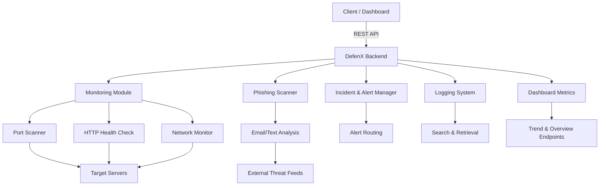

# DefenX Backend

[](https://opensource.org/licenses/MIT)
[](https://github.com/rabindra789/defenx/actions/workflows/ci.yml)
[](https://www.python.org/)
[](https://fastapi.tiangolo.com/)
[](https://www.docker.com/)
[](CONTRIBUTING.md)

**DefenX** is a cybersecurity monitoring backend designed for SMEs. It provides **real-time server scanning**, **threat detection**, **logs**, **alerts**, **dashboard metrics**, and a **phishing detection API**. The backend exposes a clean REST API for a frontend dashboard or client applications.

---

## 🚀 Features

- Real-time **server port scanning** and HTTP checks.
- **Incident & alert management** for suspicious activity.
- **Centralized logging** with search and recent logs.
- **Dashboard endpoints** for metrics and trends.
- **Config endpoints** to view/update scan settings.
- **Phishing scanner** for email or text content.
- **Health endpoints** to check service status.
- **OpenAPI / Swagger documentation** available.

---

## 🏗 Architecture



## Additional Documentation

| File | Description |
|------|-------------|
| [`frontend-guide.md`](frontend-guide.md) | Frontend integration guide |
| [`netmon-daemon.md`](netmon-daemon.md) | Network monitoring daemon setup |
| [`defenx-service.md`](defenx-service.md) | Running DefenX as a system service |
| [`Dockerfile`](Dockerfile) | Container build configuration |
| [`docker-compose.yml`](docker-compose.yml) | Multi-service deployment |

---

## 📦 Installation

```bash
git clone https://github.com/rabindra789/defenx.git
cd defenx
python3 -m venv venv
source venv/bin/activate
pip install -r requirements.txt
````

---

## 🏃 Running the Backend

```bash
uvicorn app.main:app --host 0.0.0.0 --port 8000 --reload
```

* Server runs at: `http://localhost:8000`
* Interactive API docs:

  * Swagger UI: `http://localhost:8000/docs`
  * Redoc: `http://localhost:8000/redoc`

---

## 📂 API Structure

All endpoints are grouped under `/api`:

| Module     | Prefix           | Description                          |
| ---------- | ---------------- | ------------------------------------ |
| Monitoring | `/api/monitor`   | Trigger scans, get last scan results |
| Incidents  | `/api/incidents` | List and fetch incidents             |
| Alerts     | `/api/alerts`    | List, acknowledge alerts             |
| Logs       | `/api/logs`      | Get recent logs, search logs         |
| Dashboard  | `/api/dashboard` | Overview & trend metrics             |
| Config     | `/api/config`    | View or update scan settings         |
| Health     | `/api/health`    | Backend & scanner health, metrics    |
| Phishing   | `/api/phishing`  | Scan email/text for phishing         |

---

### Example Endpoints

#### Trigger a Scan

```http
POST /api/monitor/scan
Content-Type: application/json

{
  "ports": [22, 80, 443]
}
```

#### Get Last Scan

```http
GET /api/monitor/last
```

#### Phishing Scan

```http
POST /api/phishing/scan
Content-Type: application/json

{
  "content": "Please click here to verify your account",
  "custom_keywords": ["verify"],
  "custom_domains": ["malicious.com"]
}
```

#### Dashboard Overview

```http
GET /api/dashboard/overview
```

---

## ⚙ Configuration

Configurable in `app/core/config.py`:

```python
scan_ports_default = [22, 80, 443, 3306, 8080]
scan_timeout = 2               # seconds per port
scan_concurrency = 100         # concurrent port checks
scan_target = "127.0.0.1"      # default target server
scan_interval_seconds = 60     # automatic scan interval in seconds
```

Frontend can also use `/api/config` endpoints to read/update settings at runtime.

---

## 📝 Notes for Frontend Developers

1. All routes are prefixed with `/api`.
2. Use **Swagger docs** at `/docs` for interactive testing.
3. The **scanner runs automatically** in the background; `/api/monitor/last` always returns the latest scan.
4. Alerts and incidents are available in real-time; use `/api/alerts/latest` and `/api/incidents/all`.
5. Phishing API is standalone; you can call it whenever an email/text needs checking.

---

## 🛠 Tech Stack

* Python 3.11+
* FastAPI
* HTTPX (for async HTTP checks)
* Asyncio (for concurrency)
* In-memory storage (can be extended to DB)
* OpenAPI / Swagger UI for API docs

---

## 📄 License

MIT License
